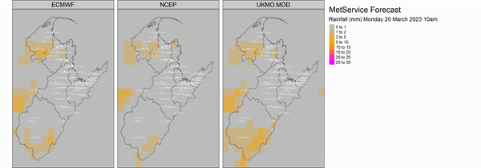
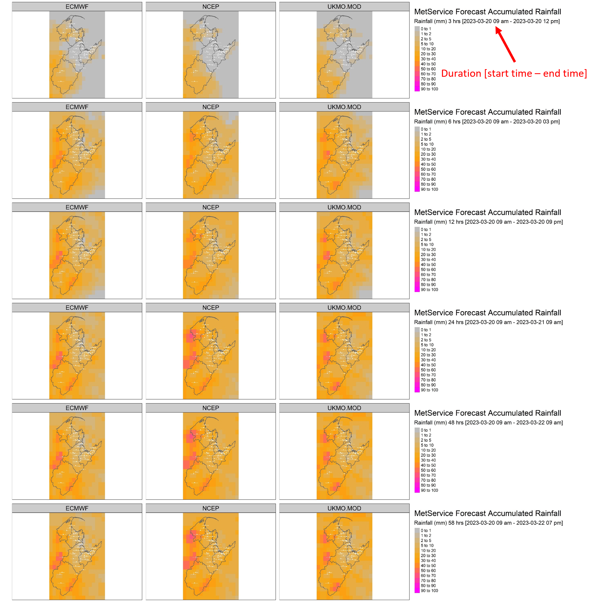
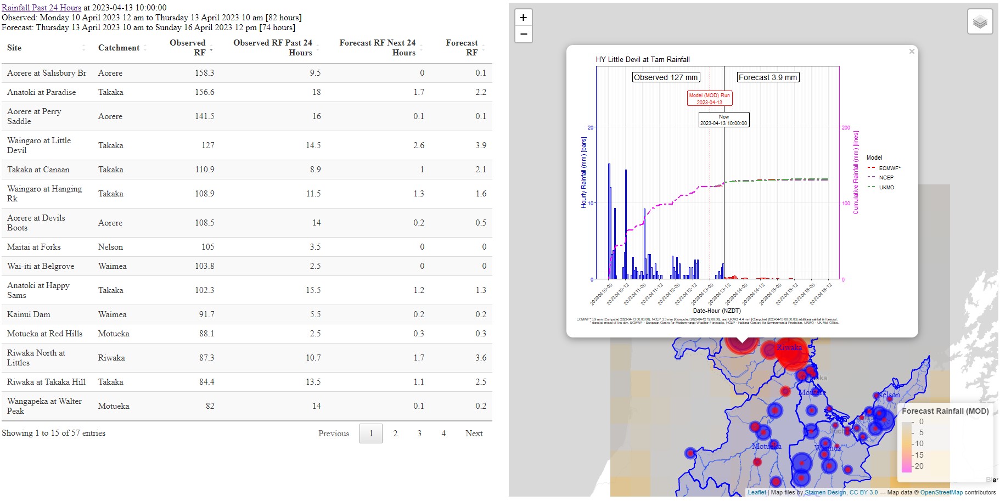

# MetService Visualisation

A set of visualisation's which show recent observed and forecast rainfall, both at a regional level and at a site-specific level.

Generates:

1.  animation (.mp4) of forecast rainfall

2.  image of forecast accumulated rainfall

3.  summary (.html) of observed and forecast rainfall (\~3 days either side of when the visualisation was produced)

